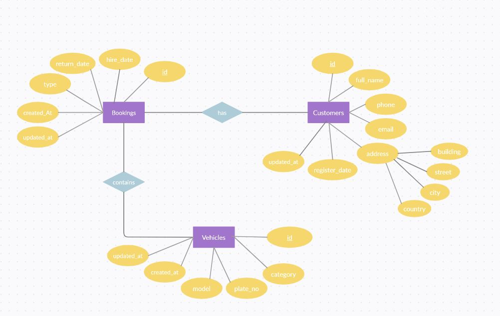

# Car_Hire_System_usingFlask
Flask microframework based booking system to manage renting cars and vans.

### :paperclip: Technologies
 &nbsp; &nbsp; &nbsp; &nbsp;
 &nbsp; &nbsp;
 &nbsp;
 &nbsp;

### :paperclip: Database Design (ERD)

### :paperclip: Database Indeces
:one:	 bookings(hire_date) &nbsp; &nbsp; &nbsp; &nbsp;==> as it will be used frequently for daily Reports  
:two:	 bookings(return_date) &nbsp; &nbsp; ==> as it will be used frequently for daily Reports  
:three:	 customers(email) &nbsp; &nbsp; &nbsp; &nbsp; &nbsp; &nbsp; ==> as it's used frequently in search customer stored data  

### :paperclip: Screenshots
  
  
  
  
  
  
